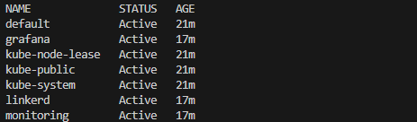
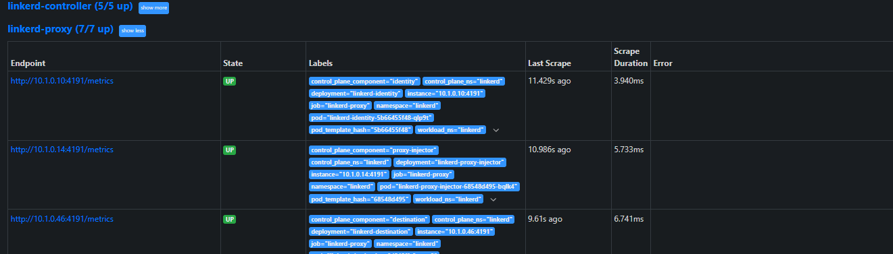
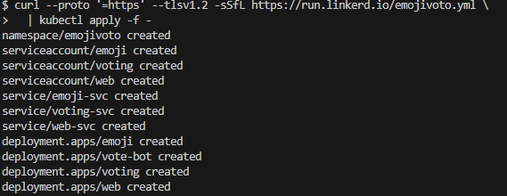
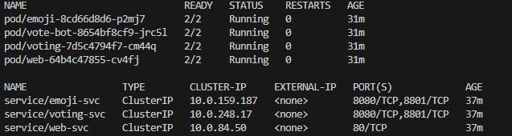
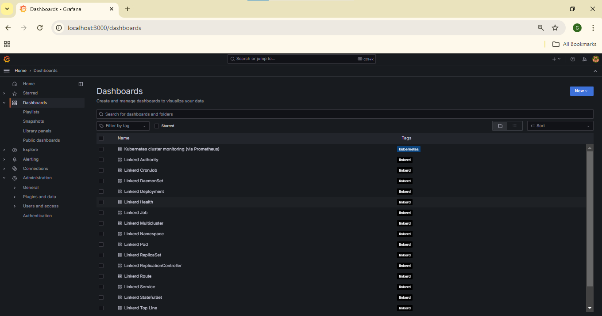
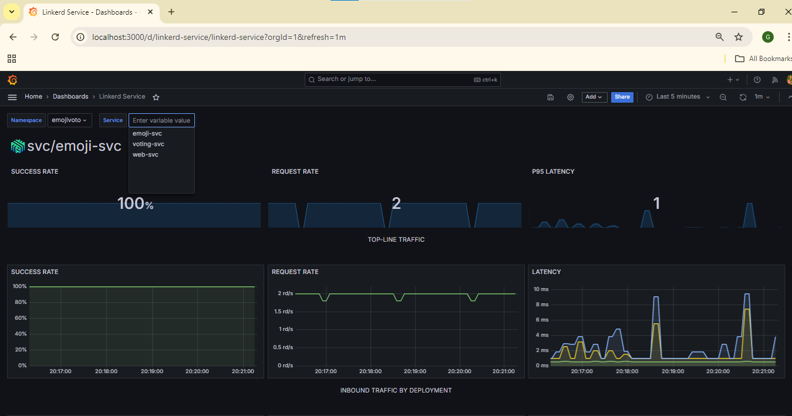
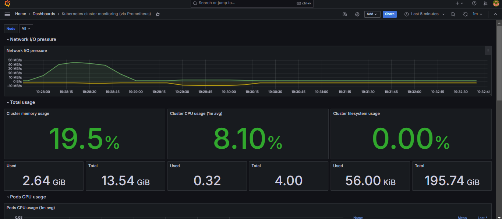

# Linkerd Service mesh Observability

This repository documents the process I took for configuring **Prometheus** and **Grafana** for monitoring **Linkerd** metrics (linkerd proxy & control plane) in a Kubernetes environment. I have learned that you should never use the Prometheus that Linkerd Viz installs in production: it uses volatile storage for its metrics, so every time its Pod restarts, you’ll lose all your historical data. Instead, install your own Prometheus and use that. Linkerd can be installed via Helm rather than with the linkerd install command. This is recommended for production, since it allows for repeatability. I will be using Infrastructure as Code with Terraform to automate the setup.


## Prerequisite: 
generate mTLS certificates
To do automatic mutual TLS, Linkerd requires trust anchor certificate and an issuer certificate and key pair. When you’re using linkerd install, these are generated  for you. However, for Helm, you will need to generate these yourself.

I got the steps for generating your own mTLS root certificates from the linkerd [documentation](https://linkerd.io/2-edge/tasks/generate-certificates/#trust-anchor-certificate).

## Table of Contents

- [Configure Prometheus for Linkerd Metrics](#configure-prometheus-for-linkerd-metrics)
- [Grafana Configuration](#grafana-configuration)
- [Accessing Grafana](#accessing-grafana)

---

After running the ```terraform apply``` command, you should have this created in your cluster



## Configure Prometheus for Linkerd Metrics

To monitor Linkerd metrics, you need to set up an external **Prometheus** instance. This will scrape the control plane and proxy metrics in a format consumable by both users and Linkerd components. To scrape **Linkerd** metrics, you'll need to modify the Prometheus configuration.

### Step 1: Modify the Prometheus ConfigMap

1. Export the current configuration:
    ```bash
    kubectl get configmap prometheus-server -o yaml > prometheus-config.yaml
    ```

2. Edit the `prometheus-config.yaml` file to add Linkerd scrape jobs. I got the scrape configuration that has to be applied to the external Prometheus instance from the linkerd  [documentation](https://linkerd.io/2.12/tasks/external-prometheus/#prometheus-scrape-configuration).
    ```
    kubectl -n linkerd-viz  get configmap prometheus-config -o yaml > linkerd-viz.yml
    ```

3. Save and apply the configuration.

### Step 1.1: Verify the Configuration

You can check if Prometheus is scraping the Linkerd jobs by visiting `http://localhost:9090/targets`.

---


## Grafana Configuration

To visualize the metrics, you need to configure **Grafana**  to use Prometheus as a data source.

### Step 2: Install and modify Grafana values.yaml

1. Download the **values.yaml** file from Linkerd's GitHub repository, the file grafana/values.yaml provides a default Helm config for the Grafana official Helm chart, which pulls the Linkerd dashboards published at https://grafana.com/orgs/linkerd/dashboards:
    ```bash
    curl -O https://raw.githubusercontent.com/linkerd/linkerd2/main/grafana/values.yaml
    ```

2. Modify the `values.yaml` file to point to your Prometheus instance , in particular:
   -  ```datasources.datasources.yaml.datasources[0].url ``` should point to your Prometheus service
   -  auth and log settings under grafana.ini
    
   
 If you are accessing Grafana directly at http://localhost:3000, then the root_url in the `values.yaml` should not contain /grafana/. It should simply be /.

Correct root_url Setting
Update your grafana.ini configuration to reflect the correct URL. If you are accessing Grafana at http://localhost:3000, the correct root_url should look like this:
  ```yaml
  grafana.ini:
    server:
      root_url: '%(protocol)s://%(domain)s:%(http_port)s/'
   ```
If Grafana is Accessed via a Subpath
If you are using a reverse proxy (like NGINX) and accessing Grafana on a subpath, such as http://your-domain/grafana/, then the root_url should include the /grafana/ path. In that case, you can use the following:
  ```yaml
  grafana.ini:
    server:
      root_url: '%(protocol)s://%(domain)s:/grafana/'
  ```

---
## Install a demo app
 I installed a demo application called Emojivoto. Emojivoto is a simple standalone Kubernetes application that uses a mix of gRPC and HTTP calls to allow the user to vote on their favorite emojis.
Install Emojivoto into the emojivoto namespace by running:
```
curl --proto '=https' --tlsv1.2 -sSfL https://run.linkerd.io/emojivoto.yml \
  | kubectl apply -f -
```
 

 To see  the app Forward web-svc locally to port 8080 by running:
 ```
kubectl -n emojivoto port-forward svc/web-svc 8080:80
```


After deploying the application you will have  to "mesh" it , that is , to add Linkerd’s data plane proxies to it. We do that by running:
```
kubectl get -n emojivoto deploy -o yaml \
  | linkerd inject - \
  | kubectl apply -f -
```


## Accessing Grafana

After installation, you can access Grafana locally:

1. Use port-forwarding to access Grafana:
    ```bash
    kubectl port-forward -n grafana svc/grafana 3000:80
    ```

2. Navigate to `http://localhost:3000`. The default login credentials are:
    - **Username:** admin
    - **Password:** Retrieve the password using:
        ```bash
        kubectl get secret --namespace grafana grafana -o jsonpath="{.data.admin-password}" | base64 --decode
        ```
   We can see the list of dashboards that have been created 
    
    Now let us take a look at some of this dashboards
    
    

   The metrics displayed in the dashboards above align with what are often referred to as Golden Signals in monitoring and observability. The Golden Signals are a set of key metrics recommended for monitoring microservices, especially in distributed systems. They help to understand the performance and health of services.

# References
- [Network Monitoring with the Linkerd Service Mesh](https://buoyant.io/blog/network-monitoring-with-the-linkerd-service-mesh)
- [Bringing your own Prometheus](https://linkerd.io/2.12/tasks/external-prometheus/)
- [Installing Linkerd with Helm](https://linkerd.io/2-edge/tasks/install-helm/#)
